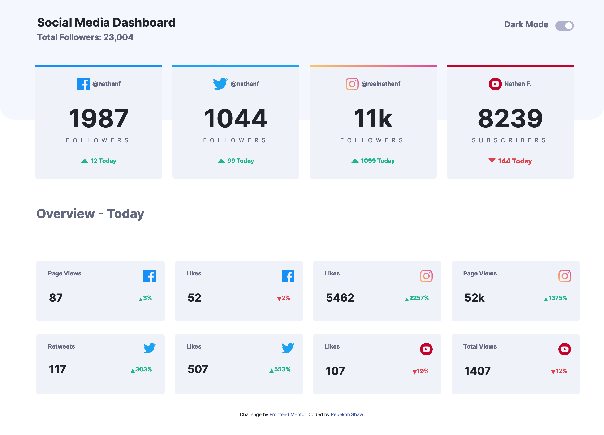
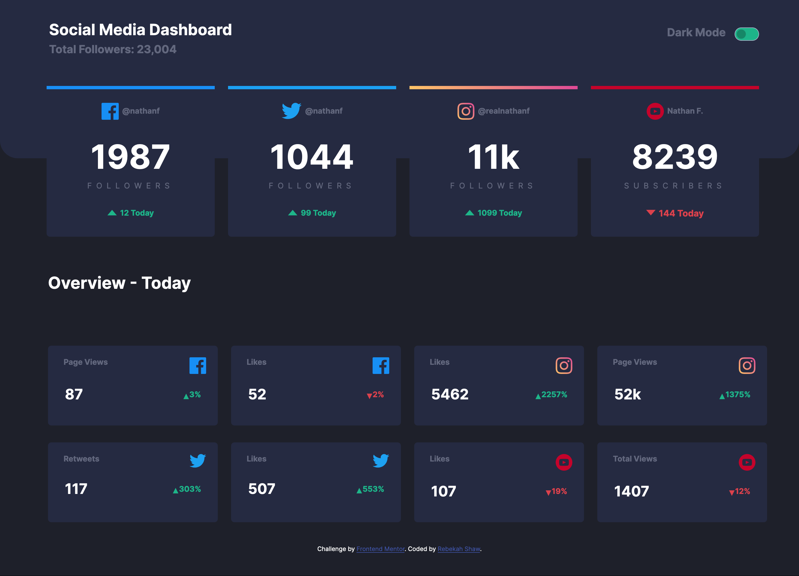
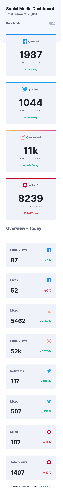
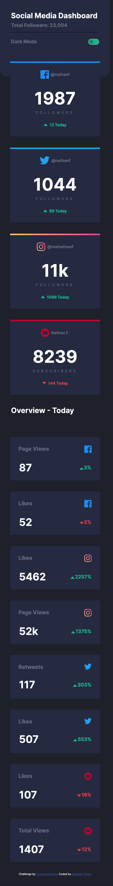

# Frontend Mentor - Social media dashboard with theme switcher solution

This is a solution to the [Social media dashboard with theme switcher challenge on Frontend Mentor](https://www.frontendmentor.io/challenges/social-media-dashboard-with-theme-switcher-6oY8ozp_H). Frontend Mentor challenges help you improve your coding skills by building realistic projects. 

## Table of contents

- [Overview](#overview)
  - [The challenge](#the-challenge)
  - [Screenshot](#screenshot)
  - [Links](#links)
- [My process](#my-process)
  - [Built with](#built-with)
  - [What I learned](#what-i-learned)
  - [Continued development](#continued-development)
  - [Useful resources](#useful-resources)
- [Author](#author)

## Overview

### The challenge

Users should be able to:

- View the optimal layout for the site depending on their device's screen size
- See hover states for all interactive elements on the page
- Toggle color theme to their preference

### Screenshot

#### Desktop Light

#### Desktop Dark

#### Mobile Light

#### Mobile Dark

### Links

- Solution URL: [ Solution](https://github.com/rebekahshaw92//social-media-dashboard-with-theme-switcher)
- Live Site URL: [Live Site](https://rebekahshaw92.github.io//social-media-dashboard-with-theme-switcher)

### Built with

- Semantic HTML5 markup
- CSS custom properties
- Sass
- JavaScript
- Bootstrap 5
- Mobile-first workflow

### What I Learned

Through doing this project I learned how to create a layout with a dark mode. I simply created a toogler and then added a new class each time the toggler is clicked.

### Continued Development

I would like to continued working both with JavaScript and Bootstrap 5.

### Userful Resources 

- [Bootstrap](https://getbootstrap.com) - This site helped me learn all I needed to know about Bootstrap.

-[Slider](https://www.w3schools.com/howto/howto_js_slideshow.asp) - This allowed me to learn how create a slider using JavaScript 

## Author

- Website - [Rebekah Shaw](https://www.rebekahshaw.com)
- Frontend Mentor - [@rebekahshaw92](https://www.frontendmentor.io/profile/rebekahshaw92)
- Twitter - [@x_beckyboo_x](https://www.twitter.com/x_beckyboo_x)